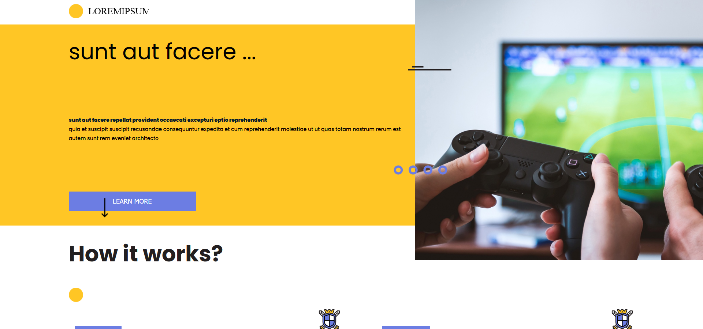
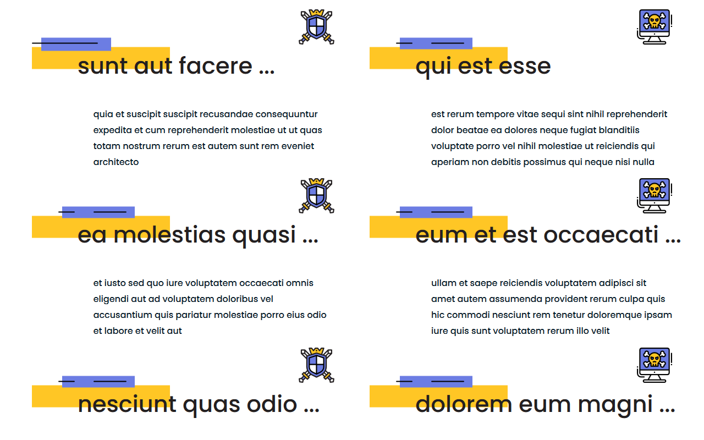
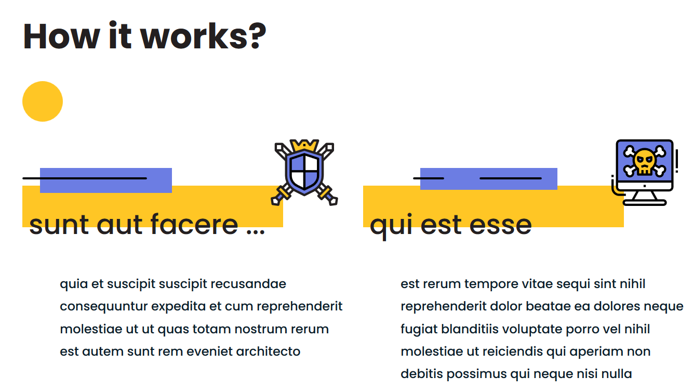
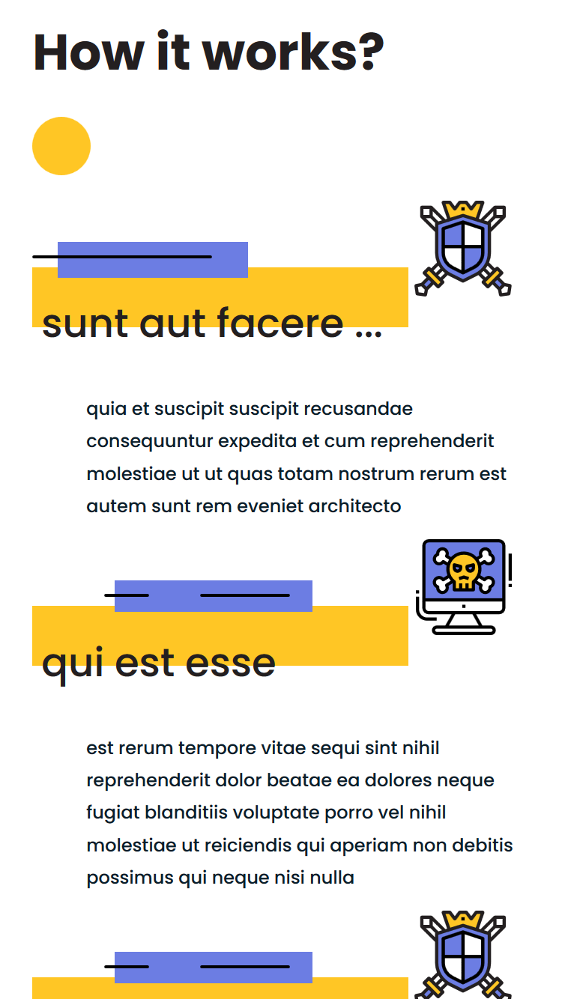

# KG recruitment assignment by Karol Szpek i Tomek Tarabasz i super Tomek Toarabasz wogole jest genialny
sdf
s
fs
df
sdf
sd
fs
f
sd
f
## 1. REACT APP LIVE DEMO: https://kgrecruitmentkarolsz15.web.app

## 2. STATIC TEMPLATE LIVE DEMO: https://karolsz15.github.io/CG/

## 3. DESCRIPTION

HTML and CSS responsive template was coded on the basis of provided graphic design. The template's files are available in the /docs directory.
React application fetches fake data from jsonplaceholder's webpage ( https://jsonplaceholder.typicode.com/posts ) in order to render dynamic content. 
Number of displayed post was limited to 6 (the number can be changed easily in Container.js file - line 45).
Some of the titles were shortened in order to fit in the grid (such titles were marked with '...' sign).

## 4. INSTRUCTIONS HOW TO RUN REACT APP LOCALLY

1. Go to React App project directory in your terminal (e.g. `cd C:/project_directory/KG/kg-react/`).
2. Run `npm install` in your terminal in order to install all dependencies.
3. Run `npm start` in your terminal in order to start local server.
4. Browse `http://localhost:3000/` in your browser to see the App.

## 5. SCREENSHOTS:

#### 1. Homepage - desktop view
</img>

#### 2. Posts grid - desktop view
</img>

#### 3. Posts grid - mobile landscape view
</img>

#### 4. Homepage - mobile portrait view
</img>

#### 5. Posts grid - mobile portrait view
</img>
